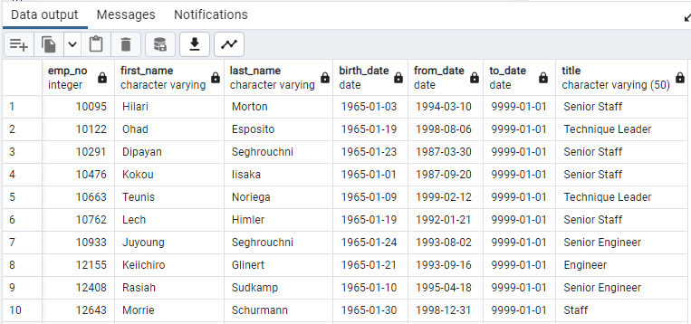

# Pewlett Hackard Analysis
This project focused on honing our knowledge and skills of data modeling, engineering, and analysis.

## Table of Contents
- [Overview of Database Analysis](#overview-of-database-analysis)
  - [Resources](#resources)
  - [Objectives](#objectives)
  - [GitHub Repo Branches](#github-repo-branches)
- [Database Engineering and Analysis Results](#database-engineering-and-analysis-results)
  - [Deliverable 1](#deliverable-1)
  - [Deliverable 2](#deliverable-2)
- [Summary](#summary)
- [References](#references)

## Overview of Database Analysis
Module 7 assignment fostered further understanding of database models, relational database management systems (DBMSs), and effective techniques for exploring databases through the use of an open source DBMS, PostgreSQL and pgAdmin. Structured Query Language (SQL) is one of the most widely used query languages today for exploring databases. We then applied some query techniques for performing employee research of Pewlett Hackard employee databases and compiling a list of all employees eligible for the retirement package and mentorship programs.

### Resources
- Input file: Resources.zip
- SQL script: Employee_Database_challenge.sql, schema_queries.sql
- Output file: retirement_titles.csv, unique_titles.csv, retiring_titles.csv, mentorship_eligibilty.csv, mentoring_titles.csv, workforce_gaps.csv
- Image file: png files
- Software: [PostgreSQL](https://www.postgresql.org/docs/), [Quick DBD - free DBD canvas](https://app.quickdatabasediagrams.com/#/)

### Objectives
Our goal is to understand the DBMS concepts through the use of systematic steps and effective tools that are commonly used when modeling, engineering, and exploring databases, which could be applied for delivering the required employee data analysis. Outline of our deliverables and a written report for presenting our results and analysis summary:

- ☑️ Deliverable 1: The Number of Retiring Employees by Title.
- ☑️ Deliverable 2: The Employees Eligible for the Mentorship Program.
- ☑️ Deliverable 3: A written report on the employee database analysis (this ["README.md"](./README.md)).

### GitHub Repo Branches
All deliverables in Module 7 challenge are committed in this GitHub repo as outlined below.

main branch  
|&rarr; [./README.md](./README.md)  
|&rarr; ./Queries/  
  &emsp; |&rarr; [./Queries/Employee_Database_challenge.sql](./Queries/Employee_Database_challenge.sql)  
  &emsp; |&rarr; [./Queries/schema_queries.sql](./Queries/schema_queries.sql)  
|&rarr; ./Data/  
  &emsp; |&rarr; [./Data/EmployeeDB.png](./Data/EmployeeDB.png)  
  &emsp; |&rarr; [./Data/retirement_titles.csv](./Data/retirement_titles.csv)  
  &emsp; |&rarr; [./Data/unique_titles.csv](./Data/unique_titles.csv)  
  &emsp; |&rarr; [./Data/retiring_titles.csv](./Data/retiring_titles.csv)  
  &emsp; |&rarr; [./Data/mentorship_eligibilty.csv](./Data/mentorship_eligibilty.csv)  
  &emsp; |&rarr; [./Data/mentoring_titles.csv](./Data/mentoring_titles.csv)  
  &emsp; |&rarr; [./Data/workforce_gaps.csv](./Data/workforce_gaps.csv)  
  &emsp; |&rarr; [./Data/retirement_titles.png](./Data/retirement_titles.png)  
  &emsp; |&rarr; [./Data/unique_titles.png](./Data/unique_titles.png)  
  &emsp; |&rarr; [./Data/retiring_titles.png](./Data/retiring_titles.png)  
  &emsp; |&rarr; [./Data/mentorship_eligibilty.png](./Data/mentorship_eligibilty.png)  
  &emsp; |&rarr; [./Data/mentoring_titles.png](./Data/mentoring_titles.png)  
  &emsp; |&rarr; [./Data/workforce_gaps.png](./Data/workforce_gaps.png)  

## Database Engineering and Analysis Results
The Entity Relationship Diagrams (ERDs) that mimicked relationships in Pewlett Hackard employee databases can be reviewed in Fig. 1, which I created by using a free Quick DBD canvas before completing the subsequent steps. By using PostgreSQL and pgAdmin, we created SQL schema, tables, and attributes based on our ERD, and finally we wrote some SQL queries for exploring the employee database. The corresponding SQL scripts can be referred in [schema_queries.sql](./Queries/schema_queries.sql) and [Employee_Database_challenge.sql](./Queries/Employee_Database_challenge.sql).

\
**Fig. 1 Entity Relationship Diagrams of Pewlett Hackard employee databases**

### Deliverable 1
- SQL query, which included `WHERE (employees.birth_date BETWEEN '1952-01-01' AND '1955-12-31')` and `ORDER BY` clauses, was used to build a Retirement Titles table consisting of employees who are born between January 1, 1952 and December 31, 1955. We exported the Retirement Titles table as a csv file ([retirement_titles.csv](./Data/retirement_titles.csv)) in the database folder. The table contained **133776** titles because some employees could have several titles during their tenure at the company, for example **Table 1**.

**Table 1. List of titles of the retiring employees**\


- SQL query, which included `DISTINCT ON (emp_no)` on top of `WHERE (to_date = '9999-01-01')` clause, was applied to filter and generate a Unique Titles table containing the employee number, first and last name, and most recent title of the current employees. We exported the Unique Titles table as a csv file ([unique_titles.csv](./Data/unique_titles.csv)) in the database folder. There were **72458** unique titles of those employees who were retiring and **Table 2** showed a few of them.
- I executed a SQL query, which included `COUNT(emp_no)`, `GROUP BY title` and `ORDER BY count DESC` clauses, to summarize the aggregate number of retiring employees by title and sort the count column in descending order. The csv file is saved as [retiring_titles.csv](./Data/retiring_titles.csv) in the database folder. **Table 3** suggested that more than 70% of the total employees who were retiring were either Senior Engineers (**25916** employees) or Senior Staffs (**24926** employees). Only **2** of the retirement-ready employees were Managers.

**Table 2. List of the most recent titles of retiring employees**\


**Table 3. Aggregate number of the retiring employees by title**\


### Deliverable 2
To generate a list of employees who were eligible for the mentorship program, I first joined *employees*, *dept_employee* and *titles* tables, and then reused `DISTINCT ON (emp_no)` to filter the resulting table in certain order as follows.
- The results revealed that **1549** employees were eligible for the mentorship program ([mentorship_eligibilty.csv](./Data/mentorship_eligibilty.csv)) and the first 10 employees in the list are given in **Table 4**.

```
-- Create unique titles of employees eligible for the mentorship
SELECT DISTINCT ON (e.emp_no) e.emp_no,
	e.first_name,
	e.last_name,
	e.birth_date,
	de.from_date,
	de.to_date,
	tt.title
INTO mentorship_eligibility
FROM employees AS e
	INNER JOIN dept_employee AS de
		ON e.emp_no = de.emp_no
	INNER JOIN titles AS tt
		ON e.emp_no = tt.emp_no
WHERE (de.to_date = '9999-01-01')
	AND (e.birth_date BETWEEN '1965-01-01' AND '1965-12-31')
ORDER BY e.emp_no ASC;
-- Check the table
SELECT * FROM mentorship_eligibility;
```

**Table 4. List of the employees who were eligible for the Mentorship Program**\


## Summary
All deliverables have been completed and summarized without problems, though the huge gaps between numbers of retirement-ready employees and mentorship-eligible employees looked grim. I think two additional SQL queries and tables that could better forecast the impact of the upcoming "silver tsunami" were outlined in the following SQL snippets and **Table 5-6**.

```
-- Total number of mentorship-eligible titles in descending order
SELECT COUNT(emp_no),
	title
INTO mentoring_titles
FROM mentorship_eligibility
GROUP BY title
ORDER BY count DESC;

-- Change identical column names before joining
ALTER TABLE mentoring_titles
RENAME COLUMN count TO mentee_count;
ALTER TABLE mentoring_titles
RENAME COLUMN title TO mentee_title;
-- Create mentor-mentee difference by title table
CREATE TABLE mentor_mentee_diff AS
	SELECT * FROM retiring_titles rt
	FULL JOIN mentoring_titles mt ON rt.title=mt.mentee_title;

-- Aggregate the joined table
SELECT count,
	title,
	mentee_count,
	mentee_title,
	(count-mentee_count) AS workforce_gap
INTO workforce_gaps
FROM mentor_mentee_diff;
-- Check the table
SELECT * FROM workforce_gaps;
```

The aggregate number of employees who were eligible for the mentorship program sorted by title was condensed into **Table 5** and [mentoring_titles.csv](./Data/mentoring_titles.csv). We could reveal more insight and better answer the high-level questions after joining **Table 3** and **Table 5** by using `ALTER TABLE`, `RENAME COLUMN`, `CREATE TABLE`, and `FULL JOIN` clauses. The overall analysis results were summarized in **Table 6** and [workforce_gaps.csv](./Data/workforce_gaps.csv). The ***workforce_gap*** column in **Table 6** provided the delta between numbers of the retiring employees and the mentorship-eligible employees.
- How many roles will need to be filled as the "silver tsunami" begins to make an impact?
  - As soon as the "silver tsunami" generations retire, the company might need to backfill as many as **70999** roles (total ***count*** field in **Table 3** minus total ***mentee_count*** field in **Table 5**) gradually assuming that the "silver tsunami" generations are to retire in the same year. Because over 70% of the roles were Senior Engineer or Senior Staff levels, those expert roles might be hardly filled because of their expertise and specialized skills.
- Are there enough qualified, retirement-ready employees in the departments to mentor the next generation of Pewlett Hackard employees?
  - Yes, there are. **Table 6** confirmed that enough qualified and retirement-ready employees are available to mentor those less-experienced engineers, staffs, and even those who are interested in pursuing managerial positions. More than 60% of the retirement-ready employees worked in *Development*, *Production*, or *Sales* department.

**Table 5. Aggregate number of the mentorship-eligible employees by title**\


**Table 6. Workforce gaps between the retiring and mentorship-eligible employees by title**\


## References
[Database model](https://en.wikipedia.org/wiki/Database_model)\
[PostgreSQL documentation](https://www.postgresql.org/docs/)\
[PostgreSQL overview](https://www.tutorialspoint.com/postgresql/postgresql_overview.htm)\
[PostgreSQL tutorial](https://www.postgresqltutorial.com/)\
[PostgreSQL renaming a column](https://www.postgresqltutorial.com/postgresql-tutorial/postgresql-rename-column/)
